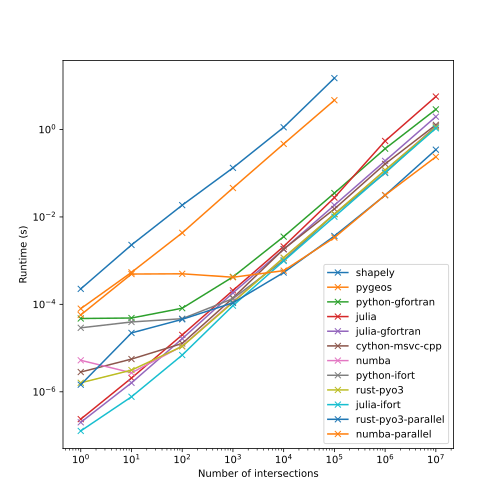
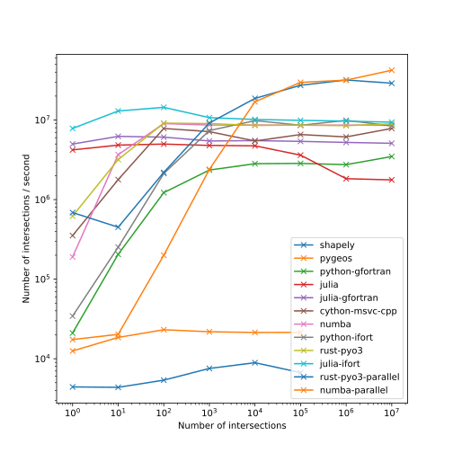

# Sutherland-Hodgman clipping benchmarks

This repository contains a basic clipping algorithm for convex polygons
implemented in a few languages (Python, Julia, Fortran, C++). Mostly to check
how performance of the numba version holds up, but also to compare how much
effort is needed to call from Python or Julia. The context is clipping millions
of polygons for 2D / 2D - layered unstructured meshes. Volume and area weighted
averages require knowing the overlap of one face to the other.


Shapely and pygeos examples are included to check I didn't totally screw up the
algorithm, but also illustrate that these GIS routines appear to be rather
unsuitable for clipping simple convex polygons in large numbers, as the
comparison between shapely and pygeos suggest the Python overhead cost is only a
factor ~2; this would suggest most of the time is spent in the algorithm,
checking for self-intersection and other degeneracies. 

## Some benchmark results

These tests deal with clipping set of N triangles by another set of N triangles.
The coordinates for these triangles are randomly generated, in the x and
y intervals [0, 1].

### Relative runtime for 100 000 intersections

| Method          |   Relative runtime |
|:----------------|-------------------:|
| shapely         |        1440.36     |
| pygeos          |         617.912    |
| numba           |           3.50484  |
| julia           |           3.13144  |
| python-gfortran |           2.32708  |
| julia-gfortran  |           2.14265  |
| python-ifort    |           1.21428  |
| julia-ifort     |           1.13889  |
| cython-msvc-cpp |           1        |
| numba-parallel  |           0.661587 |

### Runtimes for increasing number of intersections



### Intersections per second



## Assorted remarks

### Non-triangles

In theory, these implementations should work for convex polygons -- not just
triangles. However, the `area_of_intersection` functions currently only take
rectangular arrays, so that assumptions has been baked in there. The
`clip_polygons` functions should be able to deal with N vertices (not just 3).

### Fortran on Windows

On Windows, using Visual Studio, it's not entirely straightforward to call
`ifort` from the command line. `ifort` is available within a specific command
prompt, but can be made available by setting the appropriate variables using the
`ifortvars.bat`. In my case:

```
call "c:\Program Files (x86)\IntelSWTools\compilers_and_libraries_2019.5.281\windows\bin\ifortvars.bat" intel64
ifort -O2 /dll clipping.f90 -o ifort_clipping.dll
```

To check whether the appropriate exports available, `DUMPBIN` can be used
(instead of *nix `nm`):

```
DUMPBIN /exports clipping.dll
```

If you're not on Windows, maybe add `-static-intel`, i.e.:

```
ifort -O2 /dll -static-intel clipping.f90 -o ifort_clipping.dll
```

Gfortran can be installed via e.g. cygwin. Install MinGW for gfortran, make sure
to link libgfortran statically or the DLL will not be accepted. Non-MinGW
compilers require the cygwin.dll, so they won't run outside of cygwin on
Windows.

```
gfortran -O2 -shared -static-libgfortran clipping.f90 -o gfortran_clipping.dll 
```

Use `iso_c_bindings` to get a consistent name. Gfortran mangles names
differently from ifort, which also mangles names differently depending on
whether you're on *nix or Windows.


### C++ via Cython

*Don't* give your extension the same name as your `.cpp` file -- Cython will
overwrite it in generating its own `.cpp` file.

### Performance

Using C++ `std::vector` appears to be significantly slower in this case than
basic arrays `[]`. Secondly, allocating a `new` array within `clip_polygons` is
also a good bit slower than pre-allocating it in `area_of_intersection`. 
Fortran arrays seem a little nicer, as you can pass a dynamically sized array
`real(kind=8) :: dimension(:, :)` to `clip_polygons` and it'll be just as fast
as (explicitly) pre-allocated.

For C++, at first glance:

* `std::vector`: ~3.5 times slower
* `new array` in `clip_polygons`: ~2 times slower

Pre-allocating `subject` and `output` arrays does not seem to make a noticable
difference for either Julia or Numba. For numba, it's rather disadvantageous,
because `numba.prange` will not be able to parallellize if the arrays are shared.

Using a stack allocated array as presented
[here](https://github.com/numba/numba/issues/5084) does make a significant
difference, from ~7 to 3.5 relative runtime in serial, and ~2.4 to ~0.6 in
parallel.

```
import numpy as np
import numba as nb

from numba import types
from numba.extending import intrinsic
from numba.core import cgutils

@intrinsic
def stack_empty(typingctx,size,dtype):
    def impl(context, builder, signature, args):
        ty = context.get_value_type(dtype.dtype)
        ptr = cgutils.alloca_once(builder, ty, size=args[0])
        return ptr
    
    sig = types.CPointer(dtype.dtype)(types.int64,dtype)
    return sig, impl

# Example use:

@nb.njit()
def method_using_intrinsics():
    # Allocate memory on stack
    #arr_ptr can for example be passed to a wrapped c-function
    arr_ptr = stack_empty(10,np.float64)

    # Create a view on the allocated memory and do something
    arr = nb.carray(arr_ptr, 10)
    for i in range(arr.shape[0]):
        arr[i] = i

    print(arr)
```

The trouble is that the size of the array has to be a compile time constant --
but Numba being JIT, compile time is basically runtime.
